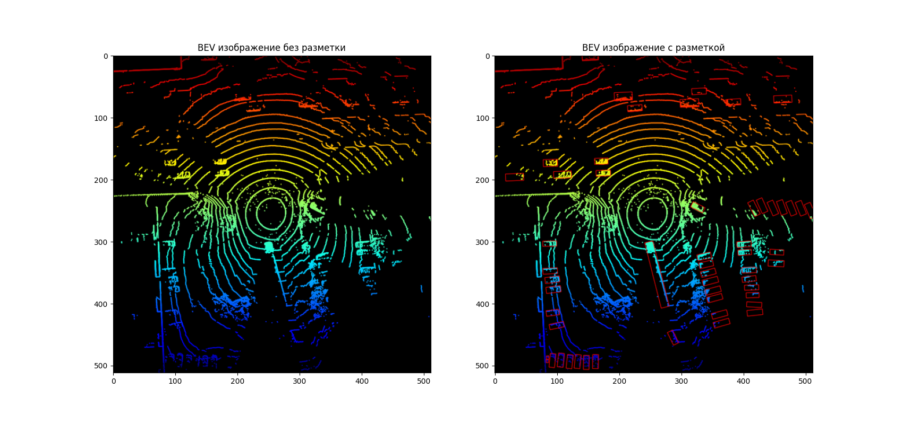

# 

## Датасет

В качестве датасета используется [Canadian Adverse Driving Conditions Dataset (CADC)](http://cadcd.uwaterloo.ca/)

Он представляет собой небольшие записанные последовательности кадров, которые содержат в себе: изображения с 8 камер,
лидарное облако точек, размеченные 3D bounding box'ы. 

Для загрузки датасета предлагается использовать тулзу [`download.py`](./download.py),
например: 

`venv/bin/python3 download.py download --base_dir data/cadc --datasets CADC`

  
--help

        
    usage: download.py [-h] [--datasets [{CADC} ...]] [--datasets_dict DATASETS_DICT] [--base_dir BASE_DIR] {download,listing}
    download
    positional arguments:
    {download,listing}
    options:
    -h, --help            show this help message and exit
    --datasets [{CADC} ...]
    --datasets_dict DATASETS_DICT
    parameter for proving parts of dataset to download. It should be dict-like string that will be parsed as ast, e.g '{'CADC': CADC_LIKE_DICT}' Parts for
    each dataset can be seen by command 'listing'
    --base_dir BASE_DIR
        

Для представления каждой последовательности кадров в датасете, существует класс [`CADCProxySequence`](datasets/cadc/cadc.py#L22).

## Birds-eye view

Самый простой подход для детекции объектов в 3D облаке точек заключается в преобразовании облака точек 
в изображение вида сверху и детекции по нему:

Сгенерировано с помощью [code_examples/draw_bev.py](code_examples/draw_bev.py)

---

Для преобразования датасета CADC в 2d object detection с поворотом выполняется препроцессинг тулзой [`rot_2d_preprocess.py`](./rot_2d_preprocess.py), например:

`venv/bin/python3 rot_2d_preprocess.py --dataset data/cadc --dataset_2d data/cadc_2d_rot --scene_size 50 --image_size 512 --train_size 0.7 --val_size 0.2 --test_size 0.1`

Для использования полученного датасета есть класс, наследующийся от `torch.utils.data.Dataset`: [`CADCBevDataset`](datasets/cadc/torch2d_rot.py#79), 
пример использования в [code_examples/cadc_2d_dataset.py](code_examples/cadc_2d_dataset.py).

---

